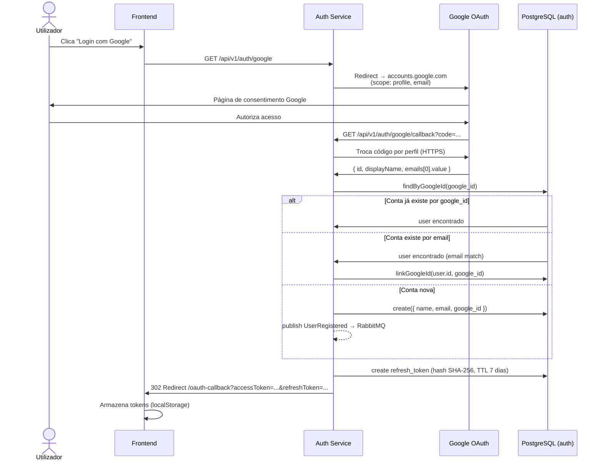
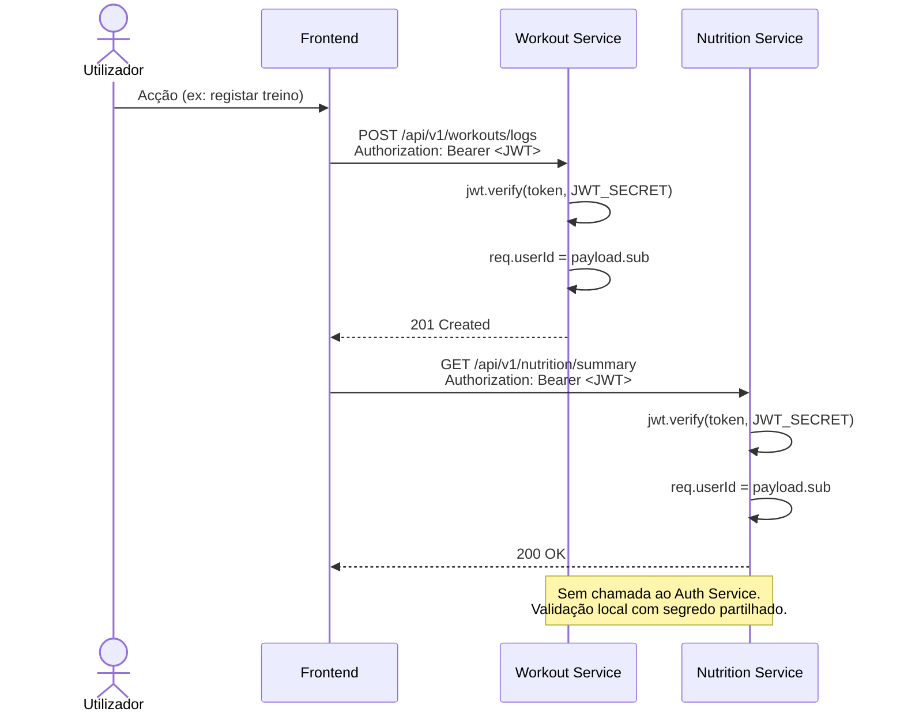

# Autenticação Externa

## Solução Adoptada

O sistema utiliza **Google OAuth 2.0** como mecanismo de autenticação externa, implementado via `passport-google-oauth20` no Auth Service. Após autenticação (por qualquer método), o Auth Service emite um **JWT (JSON Web Token)** que é usado em todos os pedidos subsequentes aos restantes microserviços.

Os dois métodos coexistem e são intercambiáveis por conta:

| Método | Mecanismo | Credenciais guardadas |
|---|---|---|
| Email + password | Bcrypt hash local | `auth.users.password_hash` |
| Google OAuth 2.0 | Delegação à Google | `auth.users.google_id` |

---

## Fluxo Google OAuth 2.0

### Diagrama de Sequência



### Passos detalhados

| Passo | Actor | Acção | Detalhe técnico |
|---|---|---|---|
| 1 | Utilizador | Inicia fluxo | `GET /api/v1/auth/google` |
| 2 | Auth Service | Redireciona para Google | `scope: ['profile', 'email']`; `session: false` (stateless) |
| 3 | Google | Página de consentimento | Utilizador autoriza partilha de nome e email |
| 4 | Google | Callback com código | `GET /api/v1/auth/google/callback?code=<auth_code>` |
| 5 | Auth Service | Troca código por perfil | `passport-google-oauth20` faz chamada HTTPS à Google API |
| 6 | Google | Devolve perfil | `profile.id`, `profile.displayName`, `profile.emails[0].value` |
| 7 | Auth Service | Resolução de conta | Procura por `google_id` → por email → cria nova |
| 8 | Auth Service | Emite tokens | JWT HS256 (15 min) + refresh token (64 bytes aleatórios, TTL 7 dias) |
| 9 | Auth Service | Redireciona | `302` para `/oauth-callback?accessToken=...&refreshToken=...&userId=...&name=...&email=...` |
| 10 | Frontend | Armazena tokens | Tokens em `localStorage`; usados em pedidos subsequentes |

### Dados recebidos da Google

| Campo | Origem | Uso no sistema |
|---|---|---|
| `profile.id` | Google unique ID | Guardado em `auth.users.google_id`; identificação em logins futuros |
| `profile.displayName` | Nome da conta Google | Guardado em `auth.users.name` (só em criação; não actualizado em logins seguintes) |
| `profile.emails[0].value` | Email principal da conta | Guardado em `auth.users.email`; chave de linking com contas email/password |

---

## Como os Outros Serviços Validam o JWT

O Auth Service é o **único emissor** de JWTs. Os restantes serviços (Workout, Nutrition, AI, Notification) **validam o token localmente** — sem chamadas ao Auth Service em cada pedido.

```
Authorization: Bearer <access_token>
```

```javascript
// Middleware de autenticação (todos os serviços Node.js)
const payload = jwt.verify(token, process.env.JWT_SECRET);
req.userId = payload.sub;  // UUID do utilizador extraído do claim 'sub'
```

```python
# Middleware de autenticação (AI Service — FastAPI)
payload = jwt.decode(token, JWT_SECRET, algorithms=["HS256"])
user_id = payload["sub"]
```

O `JWT_SECRET` partilhado é injectado via variável de ambiente em todos os serviços no `docker-compose.yml`. O `user_id` extraído do claim `sub` é usado directamente como chave de acesso às tabelas de cada serviço — sem tabela de utilizadores duplicada por serviço.

### Diagrama de validação por serviço



---

## Protecção de Rotas

Sim — a protecção de rotas é feita via JWT. O middleware de autenticação é aplicado individualmente a cada rota protegida em todos os serviços.

### Mecanismo

O cliente envia o JWT no header de cada pedido:

```http
Authorization: Bearer <access_token>
```

O middleware extrai e valida o token antes de qualquer lógica de negócio ser executada. Se inválido ou ausente, devolve `401` imediatamente.

### Implementação por serviço

**Node.js (Auth, Workout, Nutrition, Notification):**

```javascript
// src/presentation/middleware/auth.middleware.js
function authenticate(req, res, next) {
  const header = req.headers.authorization;
  if (!header?.startsWith('Bearer ')) {
    return res.status(401).json({ error: 'Token em falta' });
  }
  try {
    const payload = jwt.verify(header.split(' ')[1], process.env.JWT_SECRET);
    req.userId = payload.sub;  // UUID disponível em req.userId em toda a rota
    next();
  } catch {
    return res.status(401).json({ error: 'Token inválido ou expirado' });
  }
}
```

**Python / FastAPI (AI Recommendation Service):**

```python
# app/api/routes/recommendations.py
_bearer = HTTPBearer()

def _get_user_id(credentials: HTTPAuthorizationCredentials = Depends(_bearer)) -> str:
    try:
        payload = jwt.decode(credentials.credentials, settings.jwt_secret, algorithms=["HS256"])
        user_id = payload.get("sub")
        if not user_id:
            raise HTTPException(status_code=401, detail="Invalid token")
        return user_id
    except JWTError:
        raise HTTPException(status_code=401, detail="Invalid token")
```

### Aplicação às rotas

O middleware é aplicado por rota — não globalmente. Rotas públicas (login, registo, health check) não o usam.

```javascript
// Rotas protegidas — authenticate é middleware obrigatório
router.get('/me/profile',  authenticate, handler)
router.put('/me/profile',  authenticate, handler)
router.get('/me/goals',    authenticate, handler)
router.get('/plans',       authenticate, handler)
router.post('/plans',      authenticate, handler)
// ...

// Rotas públicas — sem middleware
router.post('/register',   handler)  // Auth Service
router.post('/login',      handler)  // Auth Service
router.get('/health',      handler)  // todos os serviços
```

### Rotas públicas vs. protegidas por serviço

| Serviço | Rotas públicas | Rotas protegidas |
|---|---|---|
| Auth Service | `POST /auth/register`, `POST /auth/login`, `POST /auth/refresh`, `GET /auth/google`, `GET /auth/google/callback`, `GET /health` | `PUT /users/me/profile`, `GET /users/me/profile`, `PUT /users/me/goals`, `GET /users/me/goals` |
| Workout Service | `GET /health` | Todas as restantes (`/plans`, `/logs`, `/exercises`) |
| Nutrition Service | `GET /health` | Todas as restantes (`/meals`, `/foods`, `/summary`) |
| AI Service | `GET /health`, `POST /admin/*` | `GET /recommendations`, `PUT /preferences` |
| Notification Service | `GET /health` | Sem endpoints HTTP próprios — acesso via RabbitMQ |

---

## Ciclo de Vida dos Tokens

| Token | Algoritmo / Geração | TTL | Armazenamento | Revogação |
|---|---|---|---|---|
| Access token | JWT HS256; `{ sub: userId }` | 15 min | Cliente (memory/localStorage) | Por expiração natural |
| Refresh token | `crypto.randomBytes(64)` | 7 dias | `auth.refresh_tokens` (hash SHA-256) | `POST /auth/logout` apaga registo na BD |

**Fluxo de renovação:**
1. Access token expira → cliente recebe 401.
2. Cliente submete `POST /api/v1/auth/refresh` com o refresh token.
3. Auth Service verifica hash SHA-256 na BD e valida TTL.
4. Auth Service emite novo par access + refresh token (rotation).
5. Registo antigo apagado; novo guardado.

---

## Justificação da Escolha

| Critério | Decisão | Razão |
|---|---|---|
| Método de autenticação externa | Google OAuth 2.0 | Amplamente adoptado; sem gestão de passwords do lado do utilizador; consentimento explícito |
| Biblioteca | `passport-google-oauth20` | Integração nativa com Express; abstrai o handshake OAuth; battle-tested |
| Sessões vs. tokens | JWT stateless | Microserviços independentes — sessões partilhadas exigiriam session store central; JWT permite validação local |
| Algoritmo JWT | HS256 (segredo partilhado) | Contexto académico; RS256 (par de chaves pública/privada) seria mais adequado em produção mas adiciona complexidade desnecessária |
| Token pass-back | Redirect com query params | Método simples para SPA; alternativa (cookies HttpOnly) seria mais segura em produção |
| Linking de contas | Automático por email | Mesmo utilizador com dois métodos de login — melhor UX sem conta duplicada |

---

## Implicações de Segurança

### Riscos identificados e mitigações

| Risco | Severidade | Mitigação adoptada |
|---|---|---|
| Tokens em query params no redirect | Média | Tokens imediatamente consumidos pelo frontend em `/oauth-callback`; URL não indexada |
| JWT_SECRET em variável de ambiente | Média | Secret único e igual em todos os serviços; em produção deveria usar secret manager (ex: AWS Secrets Manager) |
| HS256 vs. RS256 | Baixa (contexto académico) | Com HS256, qualquer serviço com o secret poderia emitir tokens; RS256 isolaria a emissão ao Auth Service |
| Access token sem revogação imediata | Baixa | TTL curto (15 min) minimiza janela de abuso; revogação real via refresh token |
| Dados Google em localStorage | Média | Sem mitigação adicional no contexto académico; em produção, cookies HttpOnly eliminam acesso XSS |
| Conta Google comprometida | Baixa | Fora do controlo da aplicação; linking por email permite que utilizador remova acesso Google |

### O que não é enviado à Google

O sistema envia à Google apenas o pedido de autenticação (OAuth handshake). **Nenhum dado de saúde, treino ou alimentação do utilizador é transmitido à Google** — esses dados ficam confinados às BDs internas dos microserviços.
