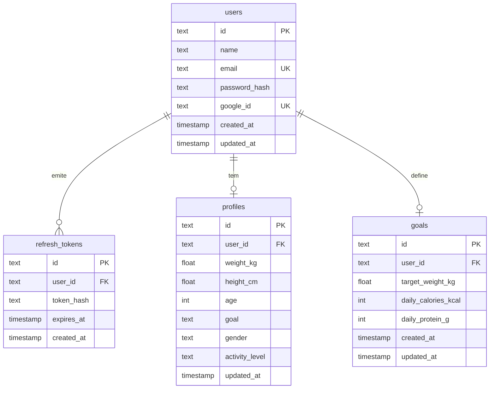
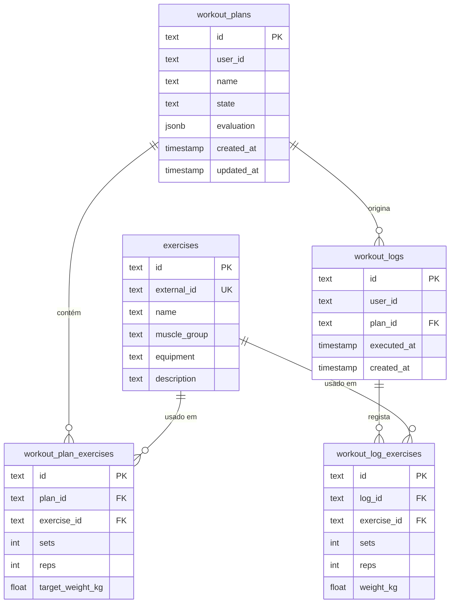
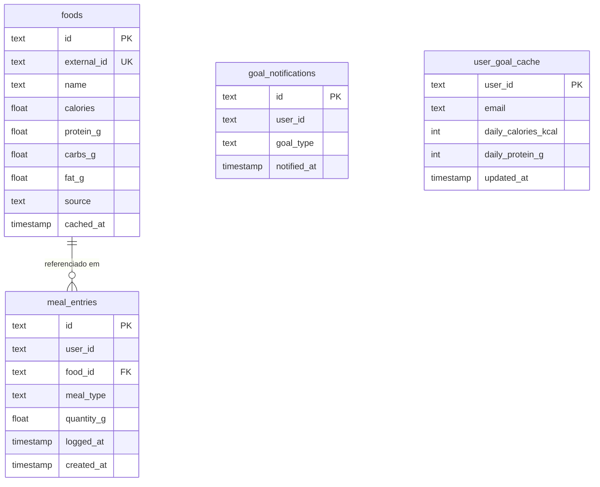
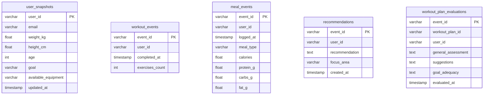

# Modelo Entidade-Relação

O sistema adopta o padrão **Database per Service**: cada microserviço tem o seu próprio schema PostgreSQL isolado. As referências cruzadas entre serviços (ex: `user_id`) são **referências lógicas** propagadas via JWT ou eventos RabbitMQ — não existem FKs físicas entre schemas.

---

## Schema `auth` (Auth Service)

Centraliza identidade, autenticação e objetivos físicos do utilizador.

---

## Schema `workout` (Workout Service)

Catálogo de exercícios, planos de treino e histórico de execuções.

**Nota:** `workout_plans.user_id` e `workout_logs.user_id` são referências lógicas ao `auth.users.id` — extraídas do JWT, sem FK física entre schemas.

---

## Schema `nutrition` (Nutrition Service)

Cache de alimentos, registo de refeições, cache de objetivos e rastreio de notificações.

**Nota:** `user_goal_cache` é uma cópia local de dados do schema `auth` — populada via eventos RabbitMQ (`GoalUpdated`, `UserRegistered`) para eliminar acoplamento síncrono entre serviços.

---

## Schema `ai` (AI Recommendation Service)

Snapshots de perfil, histórico de eventos acumulados, recomendações e avaliações de planos geradas por LLM.

**Nota:** Todas as tabelas do schema `ai` são independentes — sem FKs físicas. A idempotência é garantida pela PK `event_id` (`INSERT ... ON CONFLICT DO NOTHING`). O `workout_plan_id` é referência lógica ao `workout.workout_plans.id`.

---

## Notification Service

Serviço puramente event-driven — sem base de dados própria. Consome eventos RabbitMQ e envia emails via SMTP (Mailpit em desenvolvimento). Não persiste estado.
