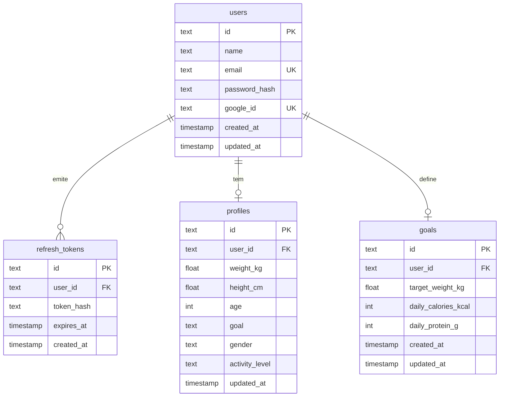
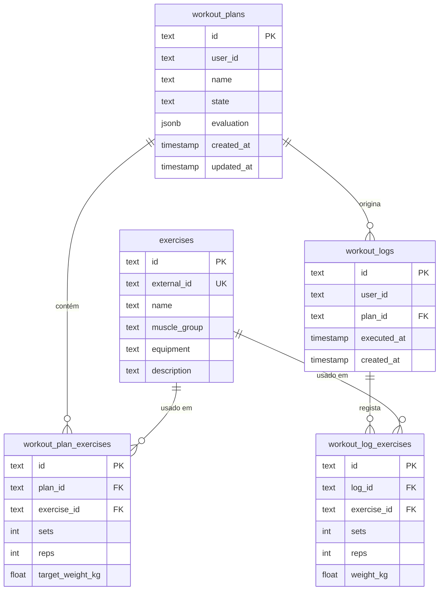
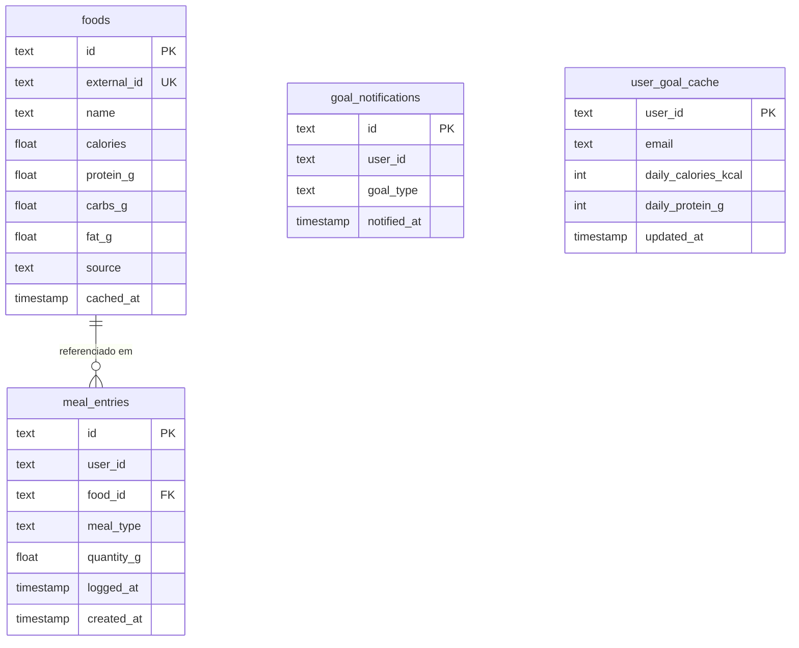
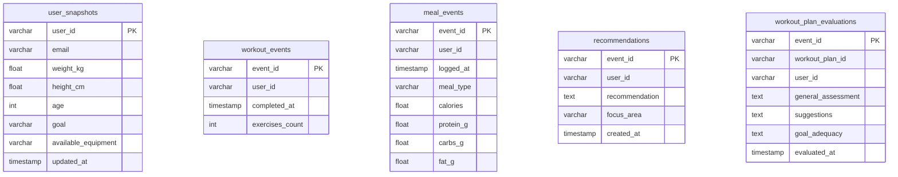

# Relatório Técnico — Decisões de Arquitetura

Sistema de acompanhamento físico baseado em microserviços com suporte de Vibe Coding.

---

## Decisões Registadas

---

## Desvios Justificados à Especificação Original

| Requisito | Spec original | Decisão tomada | Justificação |
|---|---|---|---|
| RF17 — Avaliação de plano por IA | Pedido síncrono; utilizador aguarda resposta (2–5s) | Fluxo assíncrono via RabbitMQ; utilizador notificado por email | Gemini tem latência variável; síncrono exige timeout frágil e bloqueia utilizador |
| RF12/Secção 6 — `GoalReached` publicado por Auth Service | Auth Service publica `GoalReached` para todos os objetivos | Verificação distribuída: Auth para peso; Nutrition Service para calorias/proteínas | Nutrition Service é o único com dados calóricos; Auth tornar-se-ia agregador de dados alheios |

---

## Tabela de Eventos de Domínio (actualizada)

| Evento | Routing key | Publicado por | Consumido por | Payload relevante |
|---|---|---|---|---|
| `UserRegistered` | `user.registered` | Auth Service | Notification Service, AI Service | `user_id`, `email`, `name` |
| `ProfileUpdated` | `user.profile.updated` | Auth Service | AI Service | `user_id`, `weight_kg`, `height_cm`, `age`, `goal`, `gender`, `activity_level` |
| `WorkoutCompleted` | `workout.completed` | Workout Service | AI Service | `event_id`, `user_id`, `workout_log_id`, `completed_at`, `exercises_count` |
| `MealLogged` | `meal.logged` | Nutrition Service | AI Service | `event_id`, `user_id`, `meal_id`, `logged_at`, `meal_type`, `calories`, `protein_g`, `carbs_g`, `fat_g` |
| `GoalUpdated` | `goal.updated` | Auth Service | Nutrition Service | `user_id`, `email`, `daily_calories_kcal`, `daily_protein_g` |
| `GoalReached` | `goal.reached` | Auth Service (peso) / Nutrition Service (calorias, proteínas) | Notification Service | `user_id`, `email`, `goal_type`, `value` |
| `RecommendationGenerated` | `recommendation.generated` | AI Service | Notification Service | `user_id`, `email`, `recommendation`, `focus_area` |
| `WorkoutPlanEvaluationRequested` | `workout.plan.evaluation.requested` | Workout Service | AI Service | `event_id`, `user_id`, `workout_plan_id`, `plan_data` |
| `WorkoutPlanEvaluated` | `workout.plan.evaluated` | AI Service | Workout Service, Notification Service | `event_id`, `workout_plan_id`, `user_id`, `email`, `evaluated_at`, `evaluation` |
| `WeeklySummaryGenerated` | `weekly.summary.generated` | AI Service (cron) | Notification Service | `user_id`, `email`, `summary_content` |

---

## Stack Tecnológica

| Serviço | Linguagem/Framework | BD (schema) |
|---|---|---|
| Auth Service | Node.js + Express | PostgreSQL schema `auth` |
| Workout Service | Node.js + Express | PostgreSQL schema `workout` |
| Nutrition Service | Node.js + Express | PostgreSQL schema `nutrition` |
| AI Recommendation Service | Python + FastAPI | PostgreSQL schema `ai` |
| Notification Service | Node.js + Express | PostgreSQL schema `notification` |

---

## Autenticação e Segurança

> Documento completo (fluxo OAuth, diagramas de sequência, implicações de segurança): [`autenticacao-externa.md`](autenticacao-externa.md)

O sistema suporta dois métodos de autenticação — **email + password** e **Google OAuth 2.0** — ambos resultando na emissão de um JWT pelo Auth Service. Os restantes microserviços validam o token localmente sem chamadas ao Auth Service.

| Decisão | Escolha | Justificação |
|---|---|---|
| Autenticação externa | Google OAuth 2.0 via `passport-google-oauth20` | Delegação de identidade; sem gestão de passwords do lado do utilizador; linking automático por email |
| Algoritmo JWT | HS256 — segredo partilhado via `JWT_SECRET` env var | Contexto académico; RS256 seria mais seguro em produção (isola emissão ao Auth Service) |
| Duração do access token | 15 min | TTL curto minimiza janela de abuso em caso de interceptação |
| Duração do refresh token | 7 dias | Uso frequente esperado; revogação imediata via logout (apaga registo na BD) |
| Validação JWT nos outros serviços | `jwt.verify(token, JWT_SECRET)` local — sem chamada ao Auth Service | Stateless; microserviços independentes; `payload.sub` = `user_id` usado directamente |
| Conta duplicada (email/password + Google OAuth) | Linking automático por email | Mesma email = mesmo utilizador; `google_id` nullable em `auth.users` |

---

## Comunicação Entre Serviços

| Decisão | Escolha | Justificação |
|---|---|---|
| RabbitMQ: exchange type | Exchange única `fitness.events` tipo `topic`; routing key = nome do evento | Escalável; cada consumer faz bind só aos eventos relevantes |
| RabbitMQ: routing keys | `workout.completed`, `meal.logged`, `user.registered`, `user.profile.updated`, `goal.updated`, `goal.reached`, `recommendation.generated` | — |
| Nutrition Service obtém objetivos | Evento `GoalUpdated` publicado pelo Auth Service; Nutrition Service mantém cache local `user_goal_cache` no schema `nutrition` | Desacoplamento total; Auth Service não precisa de estar up para verificar objetivos diários |
| Idempotência dos consumers | Idempotência natural: `INSERT ... ON CONFLICT(event_id) DO NOTHING` nas tabelas de destino | Sem tabela auxiliar; duplicate events silently ignored |
| AI Service obtém dados de perfil (async path) | Evento `ProfileUpdated` — AI Service mantém cópia local no schema `ai` | Desacoplamento total; Auth Service não precisa de estar up para gerar recomendações |
| AI Service obtém email para resumo semanal | Subscreve `UserRegistered` → guarda tabela local `{user_id, email}` | Subscrição mínima; não polui payloads de outros eventos |
| Perfil vazio no AI Service | Recomendação genérica sem perfil; prompt adaptado ao que existe | Melhor UX; sem acoplamento runtime extra |
| AI Service obtém dados históricos para resumo semanal | Acumula localmente via eventos `WorkoutCompleted` + `MealLogged` + `ProfileUpdated` | Cron independente de uptime dos outros serviços; dados já chegam por RabbitMQ |

---

## Workout Service

| Decisão | Escolha | Justificação |
|---|---|---|
| Transição draft → completed (relação com RF05) | Plano é template reutilizável; execução cria `WorkoutLog` separado | RF06 exige histórico de múltiplos logs do mesmo exercício para mostrar evolução de carga |
| Modificação de plano `ready` | Reset automático para `draft`; `evaluation` fica `null` | Avaliação desactualizada seria enganosa; garante consistência avaliação ↔ plano |
| ExerciseDB: estratégia de dados | Seed committed no repositório (`seeds/exercises.json`); Dockerfile importa para BD no arranque; API só chamada uma vez para gerar o ficheiro | Zero requests em runtime; demo reproduzível offline; plano BASIC tem quota horária muito restrita |

---

## Nutrition Service

| Decisão | Escolha | Justificação |
|---|---|---|
| Cache Open Food Facts: TTL | 30 dias | Dados nutricionais estáveis; trade-off consciente freshness vs. requests |
| Fallback quando alimento não encontrado | Alimento manual guardado em `foods` com `source = 'manual'`; sem TTL; reutilizável em pesquisas futuras | Melhor UX; tabela `foods` já existe para cache Open Food Facts |
| `GET /api/v1/nutrition/meals`: filtro por data | Parâmetro opcional `?date=YYYY-MM-DD`; com data usa `findByUserAndDate` (query com range `gte`/`lte`); sem data devolve histórico completo | Evita transferir todo o histórico a cada navegação de data; repositório já tinha `findByUserAndDate` usado pelo summary |
| Planeamento de refeições futuras | Mesma infra de `MealEntry`; `loggedAt` pode ser data futura; sem restrição no schema | Reutiliza modelo existente sem novas tabelas; semântica mantém-se — entrada registada para uma data, consumida ou planeada |

---

## Auth Service — Perfil e Objetivos

| Decisão | Escolha | Justificação |
|---|---|---|
| Quem verifica GoalReached e quando | Verificação distribuída: Auth verifica peso após `ProfileUpdated`; Nutrition verifica calorias/proteínas após `MealLogged` | Cada serviço é responsável pelos dados que conhece; evita Auth Service como agregador |
| Calorias diárias: input manual vs. calculado | Calculado automaticamente via **TDEE** (Total Daily Energy Expenditure) com fórmula Mifflin-St Jeor; utilizador fornece sexo + nível de atividade | Input manual é impreciso e ignora metabolismo basal; TDEE adequa-se automaticamente ao peso/altura/idade actuais |
| Fórmula TDEE utilizada | Mifflin-St Jeor: BMR(M) = 10W + 6,25H − 5A + 5; BMR(F) = 10W + 6,25H − 5A − 161; multiplicado por factor de actividade (1,2–1,9) | Mais precisa que Harris-Benedict para população contemporânea; requer sexo biológico (impacto metabólico, não identidade) |
| Novos campos no schema `auth.profiles` | `gender` (enum: male/female) e `activity_level` (enum: sedentary/light/moderate/active/very_active) | Necessários para TDEE; isolados no Auth Service — AI Service recebe via evento `ProfileUpdated` |
| Proteína diária: input manual vs. slider por g/kg | Slider 1,2–2,4 g/kg com 3 presets (Manutenção 1,6 / Desempenho 1,9 / Hipertrofia 2,2); valor em gramas calculado automaticamente pelo peso | Valores recomendados pela literatura (1,7–2,2 g/kg para atletas); slider torna o contexto científico visível; gramas absolutas derivadas automaticamente |
| Peso alvo (`target_weight_kg`) | Campo removido da interface; mantido no schema por não ser breaking | Redundante: objetivo (`lose_weight`/`gain_muscle`) já define a direcção; peso alvo sem plano temporal não é accionável |

---

## RF17 — Avaliação de Plano de Treino por IA

**Decisão:** fluxo assíncrono (desvio justificado da spec original que previa síncrono)

| Passo | Descrição |
|---|---|
| 1 | `POST /workout-plans/:id/evaluate` → Workout Service devolve `202 Accepted` imediatamente |
| 2 | Workout Service publica `WorkoutPlanEvaluationRequested` → RabbitMQ |
| 3 | AI Service consome → chama Gemini → guarda avaliação → publica `WorkoutPlanEvaluated` |
| 4 | Workout Service consome `WorkoutPlanEvaluated` → atualiza plano para `ready` com avaliação |
| 5 | Notification Service consome `WorkoutPlanEvaluated` → envia email ao utilizador |

**Justificação:** Gemini tem latência de 2–5s (podendo ser superior); fluxo síncrono bloquearia o utilizador e exigiria timeout frágil. Abordagem assíncrona é mais resiliente e melhor UX.

**Alternativas consideradas e rejeitadas:**

- **Síncrono com timeout 15s** *(opção original da spec)* — utilizador bloqueado; timeout pode falhar em pico de latência do Gemini; estado `draft` mantido silenciosamente em caso de falha.
- **Polling pelo cliente** — `GET /workout-plans/:id` até estado `ready`; funcional mas ineficiente; sem feedback proactivo ao utilizador.
- **WebSockets / Server-Sent Events** — notificação em tempo real; melhor UX mas complexidade de infraestrutura desproporcional ao contexto académico.

---

## AI Recommendation Service

| Decisão | Escolha | Justificação |
|---|---|---|
| Payloads dos eventos | `WorkoutCompleted` (event_id, user_id, completed_at, exercises_count); `MealLogged` (+ calories/macros calculados); `ProfileUpdated` (métricas físicas + goal); `UserRegistered`/`GoalReached`/`RecommendationGenerated` incluem `email` | Email incluído nos eventos consumidos pelo Notification Service — stateless, sem chamadas externas |
| Payload `WorkoutPlanEvaluated` | `workout_plan_id`, `user_id`, `email`, `evaluated_at`, `evaluation` (assessment + suggestions + goal_adequacy) | Dois consumers independentes: Workout Service actualiza plano; Notification Service envia email |
| Estrutura do prompt para Gemini | Métricas agregadas anónimas (sem PII): objetivo, peso, médias semanais vs metas; equipamento disponível quando definido | Privacidade: sem nome/email/ID direto enviado ao Gemini; equipamento torna recomendações de treino accionáveis |
| Equipamento disponível no contexto AI | Guardado em `ai.user_snapshots.available_equipment` (string CSV); endpoint dedicado `PUT /api/v1/ai/preferences`; não replicado no perfil do Auth Service | Contexto exclusivo do motor de IA; Auth Service não precisa saber; separação de responsabilidades limpa |
| Formato da resposta esperada | JSON `{ "recommendation": "...", "focus_area": "nutrition\|workout\|recovery" }` em PT-PT | Parse direto sem regex; focus_area permite categorizar recomendações |
| Resumo semanal: fonte dos dados | Acumula localmente via eventos `WorkoutCompleted` + `MealLogged` + `ProfileUpdated` | Cron independente de uptime dos outros serviços |
| Resumo semanal: cobertura de utilizadores | Só utilizadores com actividade na semana | Sem dados = sem resumo; simplifica cron e evita emails vazios |
| Resumo semanal: schedule | Segunda-feira 08:00 — cron `0 8 * * 1` | Utilizador recebe resumo da semana anterior ao iniciar a nova semana |

---

## Base de Dados

| Decisão | Escolha | Justificação |
|---|---|---|
| Partilha de user_id entre schemas | `user_id` = claim `sub` do JWT; cada serviço extrai do token sem chamada ao Auth Service | Stateless; sem tabela de utilizadores duplicada por serviço |
| Migrações: ferramenta | Prisma (Node.js services) + Alembic (AI Service Python) | Ferramentas idiomáticas por stack; reforça independência real dos microserviços |

---

## Integração de APIs Externas

> Documento completo (endpoints, formato de dados, consumo, tratamento de erros, rate limits): [`integracao-apis-externas.md`](integracao-apis-externas.md)

| API | Serviço | Autenticação | Endpoint principal | Estratégia de resiliência |
|---|---|---|---|---|
| Open Food Facts | Nutrition Service | Nenhuma | `GET /cgi/search.pl` | Cache local 30 dias; fallback stale em caso de erro |
| ExerciseDB (RapidAPI) | Workout Service | `X-RapidAPI-Key` | `GET /api/v1/exercises` | Seed committed no repo; API só em fallback |
| OpenRouter (LLM) | AI Recommendation Service | Bearer `OPENROUTER_API_KEY` | `POST /chat/completions` | Sem retry automático; 429 devolvido ao cliente |
| Mailpit (SMTP) | Notification Service | Nenhuma (Docker interno) | SMTP `:1025` | Mensagem RabbitMQ não acked se SMTP falha → volta à fila |

---

## Infraestrutura e Deploy

| Decisão | Escolha | Justificação |
|---|---|---|
| Orquestração local | Docker Compose — um `docker-compose.yml` na raiz arranca todos os serviços + PostgreSQL + RabbitMQ | Ambiente reproduzível entre membros do grupo; simplifica demonstração |
| API Gateway | nginx reverse proxy no Docker Compose; routing por prefixo de path | Ponto de entrada único; demonstra conhecimento de routing em sistemas distribuídos |

---

## Problemas Encontrados na Integração (`docker compose up`)

Problemas descobertos durante a primeira execução real do sistema integrado e respectivas correcções aplicadas.

### P1 — Conflito de portas com ambiente de desenvolvimento local

**Problema:** O ambiente de desenvolvimento tinha instâncias externas a ocupar portas que o `docker-compose.yml` tentava mapear para o host:
- Porta `5432` — PostgreSQL local (OrbStack/outro projecto)
- Portas `5433`–`5435` — outras instâncias PostgreSQL de projectos activos no OrbStack
- Porta `8080` — OrbStack a fazer proxy HTTP

**Correcção:** Mapeamentos de host ajustados para portas livres:

| Serviço | Porta interna (Docker) | Porta host (antes) | Porta host (depois) |
|---|---|---|---|
| PostgreSQL | 5432 | 5432 | 5436 |
| nginx | 8080 | 8080 | 8081 |

Os serviços internos ao Docker comunicam pela rede `int-sist_default` usando as portas originais — apenas o acesso externo (host) foi afectado.

---

### P2 — Prisma falha no Alpine Linux por ausência de OpenSSL

**Problema:** Os três serviços Node.js com Prisma (Auth, Workout, Nutrition) terminavam com:

```
Error: Could not parse schema engine response: SyntaxError: Unexpected token 'E', "Error load"...
prisma:warn Prisma failed to detect the libssl/openssl version to use
```

O Prisma depende de um binário nativo (`prisma-query-engine`) que requer OpenSSL. A imagem `node:20-alpine` usa musl libc e não inclui OpenSSL por omissão.

**Correcção:** Adicionado `RUN apk add --no-cache openssl` nos três `Dockerfile` antes do `WORKDIR`:

```dockerfile
FROM node:20-alpine
RUN apk add --no-cache openssl
WORKDIR /app
...
```

---

### P3 — Auth Service falha sem credenciais Google OAuth configuradas

**Problema:** `passport-google-oauth20` lança exceção na inicialização quando `GOOGLE_CLIENT_ID` é string vazia:

```
TypeError: OAuth2Strategy requires a clientID option
```

A estratégia era registada incondicionalmente em `app.js` mesmo sem as variáveis de ambiente definidas, impedindo o serviço de arrancar.

**Correcção:** Registo da estratégia Google condicionado à existência das credenciais:

```javascript
if (process.env.GOOGLE_CLIENT_ID && process.env.GOOGLE_CLIENT_SECRET) {
  passport.use(new GoogleStrategy(...));
}
```

O serviço arranca normalmente sem as credenciais Google; os endpoints `/auth/google/*` ficam inoperacionais mas os restantes funcionam.

---

### P4 — Migração Alembic falha com `DuplicateTable` no índice (sessão anterior)

**Problema:** A migração inicial do AI Service (`0001_initial.py`) falhava repetidamente com:

```
psycopg2.errors.DuplicateTable: relation "ix_ai_workout_events_user_id" already exists
```

**Causa raiz:** Dupla criação do mesmo índice. A API `op.create_table()` do Alembic processa `index=True` em colunas `sa.Column` e cria automaticamente o índice durante a criação da tabela. O código da migração também chamava `op.create_index(...)` explicitamente para o mesmo índice — resultado: dois `CREATE INDEX` para o mesmo nome.

**Correcção:** Removido `index=True` das colunas dentro de `op.create_table()`, mantendo apenas as chamadas explícitas `op.create_index()`:

```python
# Antes (duplicado):
sa.Column("user_id", sa.String(), nullable=False, index=True),  # cria índice implicitamente
...
op.create_index("ix_ai_workout_events_user_id", "workout_events", ["user_id"], schema="ai")

# Depois (único):
sa.Column("user_id", sa.String(), nullable=False),
...
op.create_index("ix_ai_workout_events_user_id", "workout_events", ["user_id"], schema="ai")
```

---

### P5 — `prisma migrate deploy` falha sem ficheiros de migração

**Problema:** Os três serviços Node.js (Auth, Workout, Nutrition) arrancavam mas as tabelas nunca eram criadas. O Dockerfile de cada serviço executava `npx prisma migrate deploy` no CMD, mas a directoria `prisma/migrations/` não existia. O comando termina silenciosamente sem erro e sem criar tabelas:

```
No migration found in prisma/migrations
No pending migrations to apply.
```

**Causa raiz:** `prisma migrate deploy` é um comando de CI/produção — apenas aplica ficheiros de migração previamente gerados com `prisma migrate dev`. Sem ficheiros, não faz nada.

**Correcção:** Substituído `prisma migrate deploy` por `prisma db push` nos três `Dockerfile`:

```dockerfile
# Antes:
CMD ["sh", "-c", "npx prisma migrate deploy && node src/server.js"]

# Depois:
CMD ["sh", "-c", "npx prisma db push && node src/server.js"]
```

`prisma db push` lê directamente o `schema.prisma`, cria os schemas PostgreSQL se necessário (ex: `auth`, `workout`, `nutrition`) e sincroniza as tabelas sem necessitar de ficheiros de migração.

---

### P6 — JWT_SECRET inconsistente entre serviços → 401 após OAuth

**Problema:** Após login via Google OAuth, o utilizador era imediatamente redirecionado para a página de login. Os logs nginx revelavam:

```
GET /api/v1/workouts/logs  → 401
GET /api/v1/nutrition/summary → 401
POST /api/v1/auth/refresh  → 200   (refresh bem-sucedido)
GET /api/v1/workouts/logs  → 401   (token novo, ainda 401)
POST /api/v1/auth/refresh  → 401   (segundo refresh falha — token já consumido)
```

O Axios interceptor interpretou os 401 persistentes como sessão inválida e redirecionou para `/login`.

**Causa raiz:** `JWT_SECRET` diferente entre serviços. O `auth-service` tinha sido reconstruído com `--no-cache` e leu `JWT_SECRET=qualquer_string_longa_aleatoria` do `.env`. Os outros serviços (workout, nutrition) tinham sido iniciados antes do `.env` existir e ficaram com o valor por omissão `supersecretkey`. O JWT assinado pelo auth-service era rejeitado pelos outros serviços.

**Correcção:** Removida a variável dinâmica do `docker-compose.yml` e fixado um valor único em todos os serviços:

```yaml
# Antes (valor dependia de quando .env foi criado):
JWT_SECRET: ${JWT_SECRET:-supersecretkey}

# Depois (valor fixo e igual em todos os serviços — 64 bytes aleatórios gerados via crypto.randomBytes):
JWT_SECRET: 8820ac64cf8de225d46b140cec679e5fae0412666b1587261aa7d31d0389cf604681316a3c29f43eb515cb43259d7125b5c876c2fce5d44213b63dfea9eaf5e2
```

---

### P7 — Nginx mantém IP stale após rebuild de serviço → 502

**Problema:** Após reconstrução de qualquer serviço (`docker compose up -d --build`), o nginx continuava a tentar ligar ao IP anterior do container, resultando em 502:

```
connect() failed (111: Connection refused) while connecting to upstream,
upstream: "http://192.168.158.6:3001/..."
```

**Causa raiz:** A configuração `upstream { server hostname:port; }` no nginx resolve o hostname DNS uma única vez no arranque e cache o IP indefinidamente. Quando um serviço é reconstruído obtém um novo IP — o nginx não o detecta.

**Correcção:** Substituídos os blocos `upstream` por `resolver 127.0.0.11` (DNS interno Docker) com TTL de 30s e `proxy_pass` via variável:

```nginx
# Antes:
upstream auth_service { server auth-service:3001; }
location /api/v1/auth/ { proxy_pass http://auth_service; }

# Depois:
resolver 127.0.0.11 valid=30s ipv6=off;
location /api/v1/auth/ {
  set $upstream http://auth-service:3001;
  proxy_pass $upstream;
}
```

Com esta configuração, o nginx re-resolve o DNS a cada 30 segundos, eliminando o problema após rebuilds.

---

### P8 — Alembic corre migration mas tabelas não são criadas

**Problema:** O AI Service mostrava `Running upgrade → 0001, initial` em cada arranque mas as tabelas `ai.*` nunca existiam. A migration executava sem erro visível mas não persistia.

**Causa raiz:** O `env.py` configurava `version_table_schema="ai"`, instruindo o Alembic a guardar o registo de versão em `ai.alembic_version`. Contudo, o schema `ai` só é criado **dentro** da migration (`op.execute("CREATE SCHEMA IF NOT EXISTS ai")`). Na primeira execução, o Alembic tentava aceder a `ai.alembic_version` antes do schema existir — a transacção falhava silenciosamente e o registo de versão nunca era gravado, pelo que cada restart voltava a tentar correr a mesma migration.

**Correcção:** Criação explícita do schema `ai` **antes** de configurar o contexto Alembic, fora da transacção de migração:

```python
# Antes:
with connectable.connect() as connection:
    connection.execute(text("SET search_path TO ai"))
    context.configure(connection=connection, ..., version_table_schema="ai")
    with context.begin_transaction():
        context.run_migrations()

# Depois:
with connectable.connect() as connection:
    connection.execute(text("CREATE SCHEMA IF NOT EXISTS ai"))
    connection.commit()                   # commit antes de configurar Alembic
    context.configure(connection=connection, ..., version_table_schema="ai")
    with context.begin_transaction():
        context.run_migrations()
```

---

### P9 — Serviço de email externo substituído por container local

**Problema:** O Notification Service usava a API REST do Mailtrap (serviço externo pago) para enviar emails, exigindo `MAILTRAP_TOKEN` configurado e acesso à internet.

**Decisão:** Substituído por **Mailpit** — container Docker local que intercepta todos os emails enviados e disponibiliza uma UI web em `http://localhost:8025`. Zero dependências externas; funciona offline.

**Alterações:**
- Adicionado serviço `mailpit` ao `docker-compose.yml` (SMTP `:1025`, UI `:8025`)
- `mailtrap.client.js` reescrito com `nodemailer` apontado ao Mailpit local
- Variáveis `MAILTRAP_TOKEN/FROM_EMAIL/FROM_NAME` substituídas por `SMTP_HOST/SMTP_PORT/SMTP_FROM_*`

---

### P10 — ExerciseDB: API incompatível e rate limit 429

**Problema:** O seed script original usava paginação por `offset` e campos como `ex.id`, `ex.target`, `ex.instructions`. A nova API (`edb-with-videos-and-images-by-ascendapi`) usa paginação por cursor e campos diferentes (`exerciseId`, `targetMuscles[]`, `equipments[]`). Ao tentar carregar todos os exercícios de uma vez, a API devolveu `429 Too Many Requests`.

**Decisão:** Abandonada a abordagem de seed completo. Adoptado o mesmo padrão do Nutrition Service (Open Food Facts): **fetch on-demand com cache local**.

| Aspecto | Antes | Depois |
|---|---|---|
| Estratégia | Seed one-shot de todos os exercícios | Fetch on-demand da API, cache em BD local |
| 429 | Frequente ao fazer seed completo | Eliminado (20 resultados por pesquisa) |
| Disponibilidade offline | Dependia do seed ter corrido | Cache cresce organicamente com uso |

Criado `exercisedb.client.js` e use-case `search-exercises.js` que verifica o cache local primeiro (≥5 resultados → sem chamada API) e só vai à API quando necessário.

---

### P11 — ExerciseDB: quota horária esgotada; estratégia revista para seed committed

**Problema:** O plano BASIC do RapidAPI tem quota **por hora** (não por dia). O fetch on-demand continuava a dar 429 em uso normal — cada abertura da tab de exercícios sem cache local consumia quota.

**Decisão:** Abandonada a estratégia on-demand. Adoptado **committed seed file**:

| Aspecto | On-demand (P10) | Committed seed (P11) |
|---|---|---|
| Requests à API em runtime | 1 por pesquisa sem cache | 0 — nunca |
| Quota necessária | Contínua | 1–2 requests, uma vez |
| Disponibilidade offline | Não | Sim |
| Reprodutibilidade | Depende de API key válida | Qualquer máquina, qualquer hora |

**Implementação:**
- `seeds/exercises.json` gerado uma única vez com `node scripts/seed-exercises.js --fetch` (limit=500 → 1 request para os 200 exercícios disponíveis)
- Ficheiro committed no repositório
- `Dockerfile` actualizado: copia `scripts/` e `seeds/`; CMD executa `node scripts/seed-exercises.js` (sem `--fetch`) antes do servidor — popula a BD no arranque via upsert idempotente
- `seedFromFile()` tolerante a ficheiro ausente (skip silencioso em vez de crash)
- Campos `muscleGroup` e `equipment` com fallback para `'General'`/`'Body Weight'` — schema Prisma não aceita `null` nestas colunas

---

### P12 — Nutrição: calorias não apareciam na tab e no dashboard

**Problema:** A tab "Nutrição" e o Dashboard mostravam `undefined` em todos os campos calóricos, mesmo com alimentos registados.

**Causa raiz:** Discrepância entre o contrato da API e o tipo TypeScript frontend. O endpoint `GET /api/v1/nutrition/summary` devolve:

```json
{
  "date": "2026-06-23",
  "totals": { "calories": 350, "proteinG": 20, "carbsG": 40, "fatG": 10 },
  "meals": { ... }
}
```

O tipo `NutritionSummary` no frontend declarava os campos à raiz (`summary.calories`), não dentro de `totals` (`summary.totals.calories`). Ambas as páginas (`NutritionPage.vue`, `DashboardPage.vue`) acediam diretamente aos campos inexistentes → `undefined` → nada renderizado.

**Correcção:**
- Tipo `NutritionSummary` corrigido para reflectir a estrutura real: `{ date, totals: { calories, proteinG, carbsG, fatG }, meals }`
- Todos os acessos actualizados para `summary.totals.*` em ambas as páginas

---

### P13 — Totais nutricionais sem referência ao objetivo do utilizador

**Problema:** Os MacroCards mostravam apenas o valor consumido, sem contexto de meta diária — impossível saber se o utilizador estava próximo ou acima do objetivo.

**Decisão:** Exibição no formato **consumido / objetivo** com barra de progresso.

**Implementação:**
- `NutritionPage` passou a buscar `GET /api/v1/users/me/goals` em paralelo com o summary
- `MacroCard` recebe prop opcional `total`; quando presente mostra `350/2000 kcal` e uma barra de progresso que fica verde ao atingir o objetivo
- Calorias e Proteína mostram consumido/objetivo (campos com meta definida); Hidratos e Gordura mostram apenas o consumido (sem meta configurável)
- Metas calculadas automaticamente via TDEE (calorias) e slider g/kg (proteína) na página de Perfil

---

### P14 — Navegação por datas na Nutrição: histórico e planeamento

**Problema:** A tab de Nutrição mostrava apenas o dia corrente sem forma de consultar dias anteriores ou planear dias futuros. `GET /api/v1/nutrition/meals` devolvia todo o histórico do utilizador — o filtro por data era feito no frontend — o que crescia com o uso.

**Decisão:** Navegação por data com filtragem server-side; mesma estrutura de dados para histórico e planeamento.

**Implementação — backend:**
- `GET /api/v1/nutrition/meals` aceita parâmetro opcional `?date=YYYY-MM-DD`; com data usa `findByUserAndDate` (query `gte`/`lte` já existente no repositório); sem data mantém o comportamento anterior (histórico completo)

**Implementação — frontend:**
- Botões ← / → para navegar dia a dia; botão "Hoje" visível quando fora do dia atual
- Badge contextual: **Hoje** (índigo) / **Planeamento** (amarelo, datas futuras) / **Histórico** (cinza, datas passadas)
- `getMeals(date)` passa a data como query param — carrega apenas refeições do dia selecionado
- Goals fetched uma única vez e reutilizados nas navegações seguintes (sem request repetido)
- Textos adaptativos: "Sem planeamento" vs "Sem entradas"; "Planear alimento" vs "Adicionar alimento"

**Decisão de modelo:** datas futuras usam a mesma tabela `meal_entries` com `loggedAt` no futuro — sem coluna extra ou tabela separada. A distinção histórico/planeamento é puramente temporal, não estrutural.

---

### P15 — Página de administração para demonstração de eventos assíncronos

**Problema:** A apresentação da defesa requer demonstrar os fluxos assíncronos (Gemini → RabbitMQ → email) em tempo real. O fluxo natural (completar treino, registar refeição, aguardar cron semanal) é demorado e imprevisível em contexto de apresentação.

**Decisão:** Adicionada página `/admin` com botões que forçam sincronamente/assincronamente cada evento de demonstração.

**Implementação — backend:**
- `POST /api/v1/ai/admin/recommend` — gera recomendação Gemini de forma síncrona, persiste na BD, publica `RecommendationGenerated` → Notification Service → email; devolve o texto da recomendação diretamente
- `POST /api/v1/ai/admin/weekly-summary` — lança `_generate_for_user` em `BackgroundTasks`, devolve `202` imediatamente; Gemini + email ocorrem em background
- `POST /api/v1/workouts/admin/simulate-workout` — publica `WorkoutCompleted` com UUID falso; AI Service consome o evento e gera recomendação pelo fluxo assíncrono normal

**Implementação — frontend:**
- Três cards com: descrição da acção, cadeia de eventos numerada, estado do botão (idle/loading/sucesso/erro/retrying), resultado inline
- Nota de rodapé com link para Mailpit (`localhost:8025`)

---

### P16 — Gemini free tier: quota esgotada, modelos indisponíveis e migração para OpenRouter

**Problema:** O endpoint `/api/v1/ai/admin/recommend` devolvia `500` por `ResourceExhausted` não capturada. Tentativas de mudar de modelo Gemini resultaram em outros erros. O free tier da Google AI Studio mostrou-se inadequado para uso em demonstração.

**Diagnóstico — modelos Gemini testados:**
| Modelo | Resultado | Causa |
|---|---|---|
| `gemini-2.0-flash` | 500 (ResourceExhausted) | Free tier `input_token_count` com `limit: 0` |
| `gemini-1.5-flash` | 500 (404 model not found) | Modelo não disponível em `v1beta` da conta |
| `gemini-2.0-flash-lite` | 429 (correcto) | Quota por minuto esgotada mesmo com modelo mais leve |

**Decisão — migração para OpenRouter:**

Abandonada a SDK `google-generativeai` e migrado para [OpenRouter](https://openrouter.ai/) com modelo `openai/gpt-oss-120b:free`. O OpenRouter expõe uma API compatível com OpenAI (`/v1/chat/completions`), o que simplifica o cliente e oferece acesso a múltiplos modelos free tier.

| Aspecto | Antes (Gemini) | Depois (OpenRouter) |
|---|---|---|
| SDK | `google-generativeai` | `openai` (compatível OpenAI) |
| Modelo | `gemini-2.0-flash-lite` | `openai/gpt-oss-120b:free` |
| Env var | `GEMINI_API_KEY` | `OPENROUTER_API_KEY` |
| Erro de quota | `ResourceExhausted` (google.api_core) | `RateLimitError` (openai) |
| Base URL | `generativelanguage.googleapis.com` | `https://openrouter.ai/api/v1` |

**Diagnóstico — modelos OpenRouter testados:**
| Modelo | Resultado | Causa |
|---|---|---|
| `openai/gpt-oss-120b:free` | 429 | Free tier rate limit imediato |
| `meta-llama/llama-3.1-8b-instruct:free` | 404 | Modelo sem endpoints free disponíveis |
| `google/gemma-2-9b-it:free` | 404 | Modelo sem endpoints free disponíveis |
| `openai/gpt-oss-20b:free` | ✓ sucesso | Disponível no free tier |

**Decisões de implementação:**
- `RateLimitError` + `APIStatusError` capturadas no admin endpoint → HTTP 429/4xx com mensagem clara
- Lógica de retry removida do servidor e do frontend; erro exibido directamente com botão para retry manual
- Modelo configurável via env var `LLM_MODEL` (default no código; override no `.env`) — muda sem rebuild

---

### P17 — `ProfileUpdated` sem email → snapshot com email vazio → email de notificação nunca enviado

**Problema:** O endpoint `/api/v1/ai/admin/recommend` retornava 200 mas nenhum email chegava ao Mailpit.

**Diagnóstico:**
1. `publish_recommendation_generated` só é chamado se `snapshot.email` for não-vazio
2. `ai.user_snapshots` tinha `email = ''` para o utilizador
3. Causa raiz: `publishProfileUpdated` no Auth Service não incluía `email` no payload; `_handle_profile_updated` no AI Service fazia `payload.get("email", "")` e sobrescrevia o email correcto (guardado via `UserRegistered`) com string vazia

**Correcções aplicadas:**

| Ficheiro | Alteração |
|---|---|
| `auth-service/src/infrastructure/messaging/event-publisher.js` | `publishProfileUpdated` passa agora `email`, `gender`, `activity_level` no payload |
| `auth-service/src/application/use-cases/update-profile.js` | Busca `user.email` via `userRepo.findById` antes de publicar o evento |
| `ai-service/app/infrastructure/messaging/event_consumer.py` | `_handle_profile_updated` só passa email ao upsert se não for vazio |
| `ai-service/app/infrastructure/repositories/user_snapshot_repository.py` | `on_conflict_do_update` só actualiza `email` se o novo valor for não-vazio — preserva email existente |

**Correcção pontual na BD:** `UPDATE ai.user_snapshots SET email = auth.users.email WHERE email = ''` — um registo afectado.

---

### P18 — `DetachedInstanceError`: acesso a ORM object após fecho de sessão SQLAlchemy

**Problema:** Fluxo "Simular Treino Concluído" não enviava email — `Task exception was never retrieved` nos logs do ai-service.

**Causa raiz:** `generate_recommendation.py` retornava o objecto ORM `snapshot` (SQLAlchemy) fora do executor, após `db.close()` no bloco `finally`. O acesso a `snapshot.email` fora da sessão lançava `DetachedInstanceError` silenciosamente (excepção em background task não propagada ao HTTP response).

**Correcção:** Extrair `snapshot.email` (string plain) dentro de `_db_work()` antes de fechar a sessão; retornar `(result, email_string)` em vez de `(result, snapshot_object)`.

---

### P19 — Avaliação de treino: `generalAssessment` camelCase vs `general_assessment` snake_case

**Problema:** Secção "Avaliação geral" aparecia vazia na página de detalhe do plano.

**Causa raiz:** O consumer `workout-service/src/infrastructure/messaging/event-consumer.js` convertia as chaves para camelCase (`generalAssessment`, `goalAdequacy`) ao guardar no campo JSON `evaluation` do Prisma. O frontend esperava snake_case (`general_assessment`, `goal_adequacy`) conforme o tipo `WorkoutEvaluation`.

**Correcção:** Removida a conversão desnecessária no consumer — as chaves snake_case do AI Service passam directamente para a BD. Corrigido o registo existente via SQL:
```sql
UPDATE workout.workout_plans
SET evaluation = jsonb_build_object(
  'general_assessment', evaluation->>'generalAssessment',
  'suggestions', evaluation->'suggestions',
  'goal_adequacy', evaluation->>'goalAdequacy'
) WHERE evaluation ? 'generalAssessment';
```

---

### P20 — Histórico de treinos não listava entradas

**Problema:** Tab "Histórico de Treinos" mostrava "Nenhum treino registado ainda." apesar de existirem 4 registos na BD.

**Diagnóstico:** API respondia correctamente (verificado via `curl`). A causa era um mismatch de contrato: `getWorkoutHistory` retornava exercícios com estrutura flat `{ name, muscleGroup, sets, reps, weightKg }` mas o frontend (`WorkoutHistoryPage.vue`) acedia a `ex.exercise.name` (estrutura nested). Vue 3 falha silenciosamente ao aceder `undefined.name` — os cards de treino não renderizavam e a lista parecia vazia.

**Correcção:** `getWorkoutHistory` actualizado para devolver a estrutura nested esperada pelo tipo `WorkoutLogExercise`:
```javascript
exercises: log.exercises.map(e => ({
  exerciseId: e.exerciseId,
  sets: e.sets, reps: e.reps, weightKg: e.weightKg,
  exercise: { id: e.exercise.id, name: e.exercise.name,
              muscleGroup: e.exercise.muscleGroup, equipment: e.exercise.equipment },
}))
```

---

### P21 — Goals de nutrição não actualizavam após alteração de dados físicos

**Problema:** Alterar peso/altura/nível de actividade no perfil não actualizava o total de calorias na tab de Nutrição.

**Causa raiz (1):** `ProfilePage` tinha dois botões de guardar independentes — "Dados Físicos" e "Objetivos Nutricionais". O TDEE é computado a partir dos dados físicos, mas só era persistido quando o utilizador clicava explicitamente em "Guardar" nos Objetivos. A maioria dos utilizadores guardava apenas os dados físicos.

**Correcção:** `handleSaveProfile` auto-persiste goals (TDEE + proteína) sempre que o perfil é guardado com sucesso e o TDEE pode ser calculado.

**Causa raiz (2):** `NutritionPage` cacheava goals na primeira carga (`goals.value ? cached : getGoals()`) — numa mesma sessão, navegar por datas não refazia o pedido.

**Correcção:** Removida a cache — `getGoals()` chamado em cada `loadData` para garantir que metas actualizadas são sempre reflectidas.

**Causa raiz (3):** Para datas passadas, o MacroCard mostrava `consumido / meta_actual`, tornando registos históricos enganadores após alteração de meta.

**Correcção:** `total` passado como `null` para MacroCards em datas históricas — apenas hoje e datas futuras mostram referência de meta.


---

### P22 — Documentação Swagger em todos os serviços

**Objectivo:** Adicionar documentação OpenAPI 3.0 completa a todos os serviços da aplicação — bodies de request/response, parâmetros de path/query, códigos de resposta e descrições.

**Estado anterior:**

| Serviço | Estado |
|---|---|
| auth-service | Anotações parciais — `POST /register` tinha requestBody mas login/logout/refresh não tinham corpo nem resposta; rotas Google OAuth sem documentação; endpoints internos (`GET /:id`, `GET /:id/goals`) sem anotações |
| workout-service | 11 anotações — cobertura de rotas mas sem requestBody em POST/PUT, sem path params, sem response schemas |
| nutrition-service | 6 anotações — parâmetros de query básicos mas sem requestBody em POST, sem response schemas, sem path param em DELETE |
| notification-service | Swagger inicializado com `apis: []` e descrição genérica — serviço sem rotas HTTP; eventos RabbitMQ consumidos não documentados |
| ai-service | FastAPI com Swagger automático em `/docs` — rotas sem `summary`, `responses` nem descrições; tags genéricas |

**Correcções aplicadas:**

| Serviço / Ficheiro | O que foi adicionado |
|---|---|
| `auth-service/src/presentation/routes/auth.routes.js` | `requestBody` + response schemas em login/logout/refresh; resposta 201 com campos em register; anotações Google OAuth (`GET /google`, `GET /google/callback`) |
| `auth-service/src/presentation/routes/user.routes.js` | Response schemas em `GET /me/profile` e `GET /me/goals`; `requestBody` em `PUT /me/profile` e `PUT /me/goals`; anotação no endpoint interno `GET /:id` (path param + response) |
| `nutrition-service/src/presentation/routes/meal.routes.js` | Response schema no summary; query param `date` em `GET /meals`; `requestBody` em `POST /meals`; path param + códigos em `DELETE /meals/{id}` |
| `nutrition-service/src/presentation/routes/food.routes.js` | Response schema em `GET /search`; `requestBody` + response schema em `POST /manual` |
| `notification-service/src/app.js` | Descrição alargada com tabela de 4 eventos RabbitMQ consumidos, routing keys, emails enviados e detalhes de infraestrutura (exchange, SMTP, filas) |
| `workout-service/src/presentation/routes/workout-plan.routes.js` | Response schema em `GET /plans`; path params em GET/PUT/DELETE por ID; `requestBody` em POST e PUT; descrição 202 assíncrono em `/evaluate` |
| `workout-service/src/presentation/routes/workout-log.routes.js` | Response schema detalhado em `GET /logs` (estrutura nested exercise); path param em `GET /progress/:exerciseId`; `requestBody` em `POST /logs` |
| `workout-service/src/presentation/routes/exercise.routes.js` | Response schema em `GET /exercises`; path param + response codes em `GET /exercises/:id`; exemplos de query params |
| `ai-service/app/api/routes/recommendations.py` | `summary`, `response_description`, `responses` em todos os 3 endpoints; tag `AI Recommendations` |
| `ai-service/app/api/routes/admin.py` | `summary`, `response_description`, `responses` (incluindo 429 para rate limit) em `/recommend` e `/weekly-summary`; tag `AI Admin` |

**Nota sobre notification-service:** Serviço puramente event-driven — sem endpoints HTTP próprios além de `/health`. A documentação foi adicionada à descrição da API Swagger em vez de anotações de rotas.

---

### P23 — Acoplamento síncrono entre Nutrition Service e Auth Service

**Problema:** `nutrition-service` chamava sincronamente `GET http://auth-service:3001/api/v1/users/:id/goals` (com retry exponencial de 4 tentativas) sempre que uma refeição era registada. Se o Auth Service estivesse em baixo, a verificação de objetivos diários falhava silenciosamente.

**Causa raiz:** O Nutrition Service precisava de `dailyCaloriesKcal`, `dailyProteinG` e `email` para publicar `GoalReached`. Estes dados residiam exclusivamente no schema `auth` — o Nutrition Service não tinha acesso sem chamar o Auth Service directamente.

**Decisão:** Eliminado o acoplamento síncrono. Substituído por evento `GoalUpdated` com cache local.

**Implementação:**

| Ficheiro | Alteração |
|---|---|
| `auth-service/src/infrastructure/messaging/event-publisher.js` | Adicionado `publishGoalUpdated` — routing key `goal.updated`, payload `user_id`, `email`, `daily_calories_kcal`, `daily_protein_g` |
| `auth-service/src/application/use-cases/update-goals.js` | Publica `GoalUpdated` após upsert; busca `user.email` via `userRepo.findById` |
| `auth-service/src/presentation/routes/user.routes.js` | Removido endpoint interno `GET /:id/goals` (sem consumidores) |
| `nutrition-service/prisma/schema.prisma` | Adicionado modelo `UserGoalCache` (userId, email, dailyCaloriesKcal, dailyProteinG) no schema `nutrition` |
| `nutrition-service/src/infrastructure/repositories/user-goal-cache.repository.js` | Novo — upsert/findByUserId |
| `nutrition-service/src/infrastructure/messaging/rabbitmq.client.js` | Adicionado `subscribe` (pattern idêntico ao workout-service) |
| `nutrition-service/src/infrastructure/messaging/event-consumer.js` | Novo — subscreve `user.registered` (seed email) e `goal.updated` (seed objetivos) |
| `nutrition-service/src/application/use-cases/check-daily-goals.js` | Substituído `authClient.getUserGoals()` por `goalCacheRepo.findByUserId()`; removido parâmetro `authHeader` |
| `nutrition-service/src/application/use-cases/log-meal.js` | Removido parâmetro `authHeader` da assinatura |
| `nutrition-service/src/presentation/routes/meal.routes.js` | Removido `req.authHeader` na chamada a `logMeal` |
| `nutrition-service/src/presentation/middleware/auth.middleware.js` | Removido `req.authHeader = header` (já não necessário) |
| `nutrition-service/src/infrastructure/external/auth.client.js` | **Eliminado** |
| `nutrition-service/src/server.js` | Adicionado `startConsumers()` no arranque |
| `docker-compose.yml` | Removido `AUTH_SERVICE_URL` do nutrition-service |

**Consistência eventual:** Se um utilizador registar uma refeição antes do primeiro evento `GoalUpdated` chegar (ex: objectivos nunca definidos), a verificação retorna `null` e não notifica — comportamento idêntico ao anterior quando o Auth Service devolvia 404.

---

## Acesso à Documentação Swagger (OpenAPI)

Dois modos de acesso — via nginx (porta 3000, requer stack completa) ou directo por serviço.

### Via nginx (porta 3000)

| Serviço | URL |
|---|---|
| Auth | http://localhost:3000/docs/auth/ |
| Workout | http://localhost:3000/docs/workout/ |
| Nutrition | http://localhost:3000/docs/nutrition/ |
| AI | http://localhost:3000/docs/ai/ |
| Notification | http://localhost:3000/docs/notification/ |

### Directo (bypass nginx)

| Serviço | URL | Tecnologia |
|---|---|---|
| Auth | http://localhost:3001/api-docs | swagger-ui-express |
| Workout | http://localhost:3002/api-docs | swagger-ui-express |
| Nutrition | http://localhost:3003/api-docs | swagger-ui-express |
| AI | http://localhost:3004/docs | FastAPI built-in |
| Notification | http://localhost:3005/api-docs | swagger-ui-express |

**Nota:** AI Service usa o Swagger automático do FastAPI (`/docs`) — os restantes usam `swagger-jsdoc` + `swagger-ui-express` em `/api-docs`.

---

## Modelo Entidade-Relação

> Documento completo: [`modelo-er.md`](modelo-er.md)

O sistema adopta o padrão **Database per Service** — 4 schemas PostgreSQL isolados (`auth`, `workout`, `nutrition`, `ai`). Referências cruzadas entre schemas são lógicas (via JWT ou eventos RabbitMQ), sem FKs físicas.

Resumo dos schemas:

| Schema | Serviço | Tabelas principais |
|---|---|---|
| `auth` | Auth Service | `users`, `refresh_tokens`, `profiles`, `goals` |
| `workout` | Workout Service | `exercises`, `workout_plans`, `workout_plan_exercises`, `workout_logs`, `workout_log_exercises` |
| `nutrition` | Nutrition Service | `foods`, `meal_entries`, `goal_notifications`, `user_goal_cache` |
| `ai` | AI Recommendation Service | `user_snapshots`, `workout_events`, `meal_events`, `recommendations`, `workout_plan_evaluations` |

O Notification Service não tem base de dados própria — serviço puramente event-driven.

### Schema `auth` (Auth Service)

Centraliza identidade, autenticação e objetivos físicos do utilizador.



### Schema `workout` (Workout Service)

Catálogo de exercícios, planos de treino e histórico de execuções.



**Nota:** `workout_plans.user_id` e `workout_logs.user_id` são referências lógicas ao `auth.users.id` — extraídas do JWT, sem FK física entre schemas.

### Schema `nutrition` (Nutrition Service)

Cache de alimentos, registo de refeições, cache de objetivos e rastreio de notificações.



**Nota:** `user_goal_cache` é uma cópia local de dados do schema `auth` — populada via eventos RabbitMQ (`GoalUpdated`, `UserRegistered`) para eliminar acoplamento síncrono entre serviços (ver P23).

### Schema `ai` (AI Recommendation Service)

Snapshots de perfil, histórico de eventos acumulados, recomendações e avaliações de planos geradas por LLM.



**Nota:** Todas as tabelas do schema `ai` são independentes — sem FKs físicas. A idempotência é garantida pela PK `event_id` (`INSERT ... ON CONFLICT DO NOTHING`). O `workout_plan_id` é referência lógica ao `workout.workout_plans.id`.

### Notification Service

Serviço puramente event-driven — sem base de dados própria. Consome eventos RabbitMQ e envia emails via SMTP (Mailpit em desenvolvimento). Não persiste estado.

---

## Dicionário de Dados

> Documento completo: [`dicionario-dados.md`](dicionario-dados.md)

Todas as 15 tabelas documentadas com campo, descrição, tipo, nulo?, chave e restrições.

### Schema `auth`

#### Tabela `auth.users`

| Campo | Descrição | Tipo | Nulo? | Chave | Restrições / Notas |
|---|---|---|---|---|---|
| id | Identificador único do utilizador | TEXT | NÃO | PK | UUID v4 gerado automaticamente |
| name | Nome completo | TEXT | NÃO | — | — |
| email | Endereço de email | TEXT | NÃO | UK | Único; usado para linking automático Google OAuth |
| password_hash | Hash bcrypt da password | TEXT | SIM | — | NULL quando registo exclusivo via Google OAuth |
| google_id | Identificador da conta Google | TEXT | SIM | UK | NULL quando registo email/password |
| created_at | Data de criação | TIMESTAMP(3) | NÃO | — | Default: `now()` |
| updated_at | Data da última atualização | TIMESTAMP(3) | NÃO | — | Auto-update em cada escrita |

#### Tabela `auth.refresh_tokens`

| Campo | Descrição | Tipo | Nulo? | Chave | Restrições / Notas |
|---|---|---|---|---|---|
| id | Identificador único do token | TEXT | NÃO | PK | UUID v4 |
| user_id | Utilizador a quem pertence | TEXT | NÃO | FK→users.id | `ON DELETE CASCADE` |
| token_hash | Hash SHA-256 do refresh token | TEXT | NÃO | — | Token real nunca persistido |
| expires_at | Data de expiração | TIMESTAMP(3) | NÃO | — | TTL: 7 dias a partir da emissão |
| created_at | Data de emissão | TIMESTAMP(3) | NÃO | — | Default: `now()` |

#### Tabela `auth.profiles`

| Campo | Descrição | Tipo | Nulo? | Chave | Restrições / Notas |
|---|---|---|---|---|---|
| id | Identificador único | TEXT | NÃO | PK | UUID v4 |
| user_id | Utilizador proprietário | TEXT | NÃO | FK→users.id, UK | 1:1 com `users`; `ON DELETE CASCADE` |
| weight_kg | Peso atual em kg | DOUBLE PRECISION | SIM | — | — |
| height_cm | Altura em cm | DOUBLE PRECISION | SIM | — | — |
| age | Idade em anos | INTEGER | SIM | — | — |
| goal | Objetivo físico | TEXT (enum) | SIM | — | Valores: `lose_weight`, `maintain_weight`, `gain_muscle` |
| gender | Sexo biológico | TEXT (enum) | SIM | — | Valores: `male`, `female`; necessário para cálculo TDEE (Mifflin-St Jeor) |
| activity_level | Nível de atividade física | TEXT (enum) | SIM | — | Valores: `sedentary`, `light`, `moderate`, `active`, `very_active` |
| updated_at | Data da última atualização | TIMESTAMP(3) | NÃO | — | Auto-update |

#### Tabela `auth.goals`

| Campo | Descrição | Tipo | Nulo? | Chave | Restrições / Notas |
|---|---|---|---|---|---|
| id | Identificador único | TEXT | NÃO | PK | UUID v4 |
| user_id | Utilizador proprietário | TEXT | NÃO | FK→users.id, UK | 1:1 com `users`; `ON DELETE CASCADE` |
| target_weight_kg | Peso alvo em kg | DOUBLE PRECISION | SIM | — | Campo mantido no schema; removido da UI por ser não acionável sem prazo |
| daily_calories_kcal | Meta calórica diária (kcal) | INTEGER | SIM | — | Calculado via TDEE; fórmula Mifflin-St Jeor × fator de atividade |
| daily_protein_g | Meta proteica diária (g) | INTEGER | SIM | — | Calculado via slider 1,2–2,4 g/kg de peso corporal |
| created_at | Data de criação | TIMESTAMP(3) | NÃO | — | Default: `now()` |
| updated_at | Data da última atualização | TIMESTAMP(3) | NÃO | — | Auto-update |

---

### Schema `workout`

#### Tabela `workout.exercises`

| Campo | Descrição | Tipo | Nulo? | Chave | Restrições / Notas |
|---|---|---|---|---|---|
| id | Identificador único | TEXT | NÃO | PK | UUID v4 |
| external_id | ID original da ExerciseDB | TEXT | NÃO | UK | Usado para upsert idempotente no seed inicial |
| name | Nome do exercício | TEXT | NÃO | — | — |
| muscle_group | Grupo muscular alvo | TEXT | NÃO | — | Ex: `chest`, `back`, `legs`; default `General` se ausente na API |
| equipment | Equipamento necessário | TEXT | NÃO | — | Ex: `barbell`, `dumbbell`; default `Body Weight` se ausente |
| description | Instruções de execução | TEXT | SIM | — | — |

#### Tabela `workout.workout_plans`

| Campo | Descrição | Tipo | Nulo? | Chave | Restrições / Notas |
|---|---|---|---|---|---|
| id | Identificador único | TEXT | NÃO | PK | UUID v4 |
| user_id | Utilizador proprietário | TEXT | NÃO | — | Referência lógica ao `auth.users.id` via JWT |
| name | Nome do plano | TEXT | NÃO | — | — |
| state | Estado do ciclo de vida | TEXT (enum) | NÃO | — | Valores: `draft`, `ready`, `completed`; default `draft`; volta a `draft` quando plano `ready` é editado |
| evaluation | Resultado da avaliação por IA | JSONB | SIM | — | Estrutura: `{general_assessment, suggestions[], goal_adequacy}`; NULL até avaliação concluída |
| created_at | Data de criação | TIMESTAMP(3) | NÃO | — | Default: `now()` |
| updated_at | Data da última atualização | TIMESTAMP(3) | NÃO | — | Auto-update |

#### Tabela `workout.workout_plan_exercises`

| Campo | Descrição | Tipo | Nulo? | Chave | Restrições / Notas |
|---|---|---|---|---|---|
| id | Identificador único | TEXT | NÃO | PK | UUID v4 |
| plan_id | Plano a que pertence | TEXT | NÃO | FK→workout_plans.id | `ON DELETE CASCADE` |
| exercise_id | Exercício referenciado | TEXT | NÃO | FK→exercises.id | — |
| sets | Número de séries | INTEGER | NÃO | — | — |
| reps | Repetições por série | INTEGER | NÃO | — | — |
| target_weight_kg | Peso alvo (kg) | DOUBLE PRECISION | SIM | — | NULL = exercício sem peso (corpo) |

#### Tabela `workout.workout_logs`

| Campo | Descrição | Tipo | Nulo? | Chave | Restrições / Notas |
|---|---|---|---|---|---|
| id | Identificador único | TEXT | NÃO | PK | UUID v4 |
| user_id | Utilizador que executou | TEXT | NÃO | — | Referência lógica ao `auth.users.id` via JWT |
| plan_id | Plano executado | TEXT | SIM | FK→workout_plans.id | NULL para treinos ad-hoc sem plano associado |
| executed_at | Data/hora de execução | TIMESTAMP(3) | NÃO | — | — |
| created_at | Data de criação do registo | TIMESTAMP(3) | NÃO | — | Default: `now()` |

#### Tabela `workout.workout_log_exercises`

| Campo | Descrição | Tipo | Nulo? | Chave | Restrições / Notas |
|---|---|---|---|---|---|
| id | Identificador único | TEXT | NÃO | PK | UUID v4 |
| log_id | Log a que pertence | TEXT | NÃO | FK→workout_logs.id | `ON DELETE CASCADE` |
| exercise_id | Exercício realizado | TEXT | NÃO | FK→exercises.id | — |
| sets | Séries realizadas | INTEGER | NÃO | — | — |
| reps | Repetições realizadas | INTEGER | NÃO | — | — |
| weight_kg | Peso utilizado (kg) | DOUBLE PRECISION | NÃO | — | 0.0 para exercícios sem carga |

---

### Schema `nutrition`

#### Tabela `nutrition.foods`

| Campo | Descrição | Tipo | Nulo? | Chave | Restrições / Notas |
|---|---|---|---|---|---|
| id | Identificador único | TEXT | NÃO | PK | UUID v4 |
| external_id | Código de barras / ID Open Food Facts | TEXT | SIM | UK | NULL para alimentos manuais (`source = manual`) |
| name | Nome do alimento | TEXT | NÃO | — | — |
| calories | Calorias por 100g (kcal) | DOUBLE PRECISION | NÃO | — | — |
| protein_g | Proteína por 100g (g) | DOUBLE PRECISION | NÃO | — | — |
| carbs_g | Hidratos de carbono por 100g (g) | DOUBLE PRECISION | NÃO | — | — |
| fat_g | Gordura por 100g (g) | DOUBLE PRECISION | NÃO | — | — |
| source | Origem do registo | TEXT (enum) | NÃO | — | Valores: `open_food_facts`, `manual`; default `open_food_facts` |
| cached_at | Data de cache | TIMESTAMP(3) | SIM | — | NULL para alimentos manuais; TTL: 30 dias para Open Food Facts |

#### Tabela `nutrition.meal_entries`

| Campo | Descrição | Tipo | Nulo? | Chave | Restrições / Notas |
|---|---|---|---|---|---|
| id | Identificador único | TEXT | NÃO | PK | UUID v4 |
| user_id | Utilizador que registou | TEXT | NÃO | — | Referência lógica ao `auth.users.id` via JWT |
| food_id | Alimento consumido | TEXT | NÃO | FK→foods.id | — |
| meal_type | Tipo de refeição | TEXT (enum) | NÃO | — | Valores: `breakfast`, `lunch`, `snack`, `dinner` |
| quantity_g | Quantidade consumida (g) | DOUBLE PRECISION | NÃO | — | — |
| logged_at | Data/hora da refeição | TIMESTAMP(3) | NÃO | — | Aceita datas futuras — suporte a planeamento de refeições |
| created_at | Data de criação | TIMESTAMP(3) | NÃO | — | Default: `now()` |

#### Tabela `nutrition.goal_notifications`

| Campo | Descrição | Tipo | Nulo? | Chave | Restrições / Notas |
|---|---|---|---|---|---|
| id | Identificador único | TEXT | NÃO | PK | UUID v4 |
| user_id | Utilizador notificado | TEXT | NÃO | — | Referência lógica ao `auth.users.id` |
| goal_type | Tipo de objetivo atingido | TEXT | NÃO | — | Ex: `calories`, `protein`, `weight` |
| notified_at | Data/hora da notificação | TIMESTAMP(3) | NÃO | — | Default: `now()` |

#### Tabela `nutrition.user_goal_cache`

| Campo | Descrição | Tipo | Nulo? | Chave | Restrições / Notas |
|---|---|---|---|---|---|
| user_id | Identificador do utilizador | TEXT | NÃO | PK | Referência lógica ao `auth.users.id`; sem FK física (schemas separados) |
| email | Email do utilizador | TEXT | NÃO | — | Cópia local; necessário para publicar evento `GoalReached` |
| daily_calories_kcal | Meta calórica diária (kcal) | INTEGER | SIM | — | NULL até utilizador definir objetivos no Auth Service |
| daily_protein_g | Meta proteica diária (g) | INTEGER | SIM | — | NULL até utilizador definir objetivos no Auth Service |
| updated_at | Data da última atualização | TIMESTAMP(3) | NÃO | — | Auto-update via evento `GoalUpdated` |

---

### Schema `ai`

#### Tabela `ai.user_snapshots`

| Campo | Descrição | Tipo | Nulo? | Chave | Restrições / Notas |
|---|---|---|---|---|---|
| user_id | Identificador do utilizador | VARCHAR | NÃO | PK | Referência lógica ao `auth.users.id` |
| email | Email do utilizador | VARCHAR | NÃO | — | Guardado via `UserRegistered`; necessário para enviar notificações |
| weight_kg | Peso em kg | FLOAT | SIM | — | Atualizado via `ProfileUpdated` |
| height_cm | Altura em cm | FLOAT | SIM | — | Atualizado via `ProfileUpdated` |
| age | Idade em anos | INTEGER | SIM | — | Atualizado via `ProfileUpdated` |
| goal | Objetivo físico | VARCHAR | SIM | — | Valores: `lose_weight`, `maintain_weight`, `gain_muscle` |
| available_equipment | Equipamento disponível | VARCHAR | SIM | — | CSV (ex: `barbell,dumbbells`); gerido por `PUT /api/v1/ai/preferences` |
| updated_at | Data da última atualização | TIMESTAMP | NÃO | — | — |

#### Tabela `ai.workout_events`

| Campo | Descrição | Tipo | Nulo? | Chave | Restrições / Notas |
|---|---|---|---|---|---|
| event_id | ID do evento RabbitMQ | VARCHAR | NÃO | PK | UUID do evento `WorkoutCompleted`; garante idempotência via `ON CONFLICT DO NOTHING` |
| user_id | Utilizador que treinou | VARCHAR | NÃO | INDEX | — |
| completed_at | Data/hora do treino | TIMESTAMP | NÃO | — | — |
| exercises_count | Número de exercícios realizados | INTEGER | SIM | — | — |

#### Tabela `ai.meal_events`

| Campo | Descrição | Tipo | Nulo? | Chave | Restrições / Notas |
|---|---|---|---|---|---|
| event_id | ID do evento RabbitMQ | VARCHAR | NÃO | PK | UUID do evento `MealLogged`; garante idempotência |
| user_id | Utilizador que registou | VARCHAR | NÃO | INDEX | — |
| logged_at | Data/hora da refeição | TIMESTAMP | NÃO | — | — |
| meal_type | Tipo de refeição | VARCHAR | SIM | — | Ex: `breakfast`, `lunch`, `snack`, `dinner` |
| calories | Calorias da refeição (kcal) | FLOAT | SIM | — | Calculado no Nutrition Service: `(quantity_g / 100) × food.calories` |
| protein_g | Proteína da refeição (g) | FLOAT | SIM | — | — |
| carbs_g | Hidratos de carbono (g) | FLOAT | SIM | — | — |
| fat_g | Gordura (g) | FLOAT | SIM | — | — |

#### Tabela `ai.recommendations`

| Campo | Descrição | Tipo | Nulo? | Chave | Restrições / Notas |
|---|---|---|---|---|---|
| event_id | Identificador único | VARCHAR | NÃO | PK | UUID gerado no AI Service |
| user_id | Utilizador destinatário | VARCHAR | NÃO | INDEX | — |
| recommendation | Texto da recomendação | TEXT | NÃO | — | Gerado pelo LLM (OpenRouter); em PT-PT |
| focus_area | Área de foco | VARCHAR | SIM | — | Valores: `nutrition`, `workout`, `recovery` |
| created_at | Data de criação | TIMESTAMP | NÃO | — | Default: `now()` |

#### Tabela `ai.workout_plan_evaluations`

| Campo | Descrição | Tipo | Nulo? | Chave | Restrições / Notas |
|---|---|---|---|---|---|
| event_id | ID do evento RabbitMQ | VARCHAR | NÃO | PK | UUID do evento `WorkoutPlanEvaluationRequested`; garante idempotência |
| workout_plan_id | Plano avaliado | VARCHAR | NÃO | INDEX | Referência lógica ao `workout.workout_plans.id` |
| user_id | Utilizador proprietário | VARCHAR | NÃO | — | — |
| general_assessment | Avaliação geral do plano | TEXT | SIM | — | Gerado pelo LLM; preenchido após `WorkoutPlanEvaluated` |
| suggestions | Sugestões de melhoria | TEXT | SIM | — | JSON array serializado como TEXT |
| goal_adequacy | Adequação ao objetivo do utilizador | TEXT | SIM | — | Gerado pelo LLM |
| evaluated_at | Data da avaliação | TIMESTAMP | NÃO | — | Default: `now()` |
